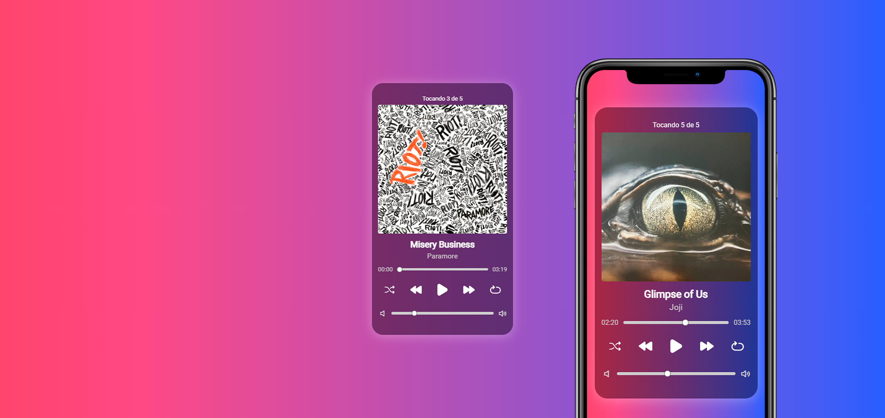

<h1 align="center">
  🎵 Player de Música
</h1>

<h4 align="center"><a href="https://juniorod99.github.io/player-de-musica/">Clique para visitar o projeto</a></h4>

## 📚 Projeto

Um player de músicas para poder ouvir minhas músicas favoritas sem interrupções.

## 💼 Tecnologias utilizadas

Para o desenvolvimento deste site utilizei as seguintes tecnologias:

- HTML;
- CSS;
- JavaScript;
- Unicons;
- Git e Github;

## 🤯 Aprendizado

Durante o desenvolvimento desse projeto aprendi novas funcionalidades do JavaScript, como a de manipulação de mídias como músicas e como trabalhar com elas.

## 🔧 Ajustes e melhorias

O projeto ainda está em desenvolvimento e as próximas atualizações serão voltadas nas seguintes tarefas:

- [ ] Pegar playlist do youtube e transformar em JSON
- [ ] Importar JSON no player de música
- [ ] Reproduzir músicas a partir do JSON
